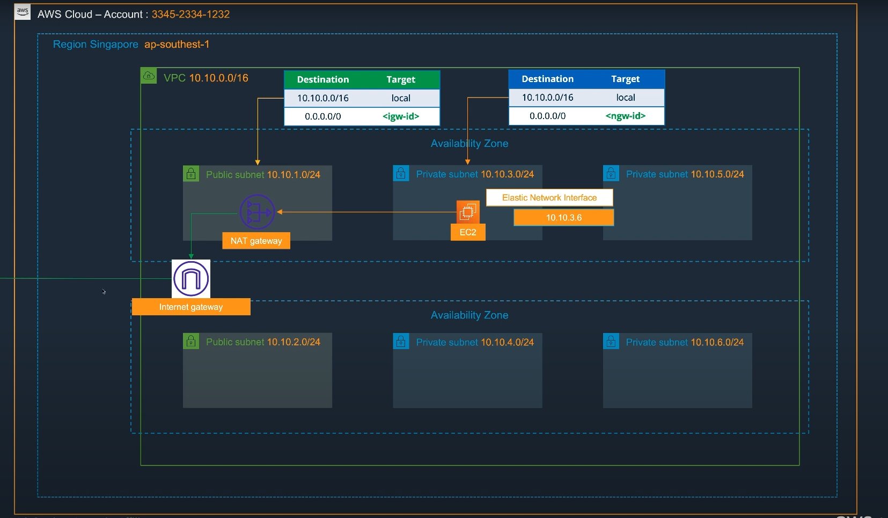

# Module 02 - Dịch vụ mạng trên AWS

## Module 02-01 - AWS Virtual Private Cloud (VPC)

### Khái niệm cơ bản
- **Amazon VPC**: Cho phép bạn khởi chạy tài nguyên AWS trong một mạng ảo mà bạn định nghĩa.  
- **VPC thuộc một Region**: Khi tạo VPC, cần khai báo CIDR IPv4 (bắt buộc) và IPv6 (tùy chọn).  
- **Giới hạn**: Mỗi AWS Account có thể tạo tối đa **5 VPC trong 1 Region**.  
- **Mục đích**: Dùng để phân tách môi trường (Production / Dev / Test / Staging).  
  > Lưu ý: Nếu muốn tách biệt hoàn toàn tài nguyên giữa người dùng, cần **tách AWS Account**, vì chỉ nhiều VPC không đủ.  

### Subnet
- VPC có thể chia thành nhiều **Subnet** (mạng con).  
- Mỗi **Subnet chỉ thuộc một Availability Zone**.  
- CIDR Subnet là tập con của CIDR VPC.  
- AWS giữ lại **5 địa chỉ IP** trong mỗi Subnet:  
  - `10.10.1.0` → Network address  
  - `10.10.1.255` → Broadcast  
  - `10.10.1.1` → Router  
  - `10.10.1.2` → DNS  
  - `10.10.1.3` → Reserved cho tính năng tương lai  

### Route Table (Bảng định tuyến)
- Tập hợp các **Route** để xác định đường đi cho mạng.  
- AWS tạo sẵn **Default Route Table** khi khởi tạo VPC (không xóa được).  
- Default Route Table chứa 1 Route duy nhất: cho phép các Subnet trong cùng VPC liên lạc với nhau.  
- Có thể tạo **Custom Route Table**, nhưng không thể xóa Route mặc định (local).  

### Elastic Network Interface (ENI)
- **ENI** là một card mạng ảo gắn vào EC2.  
- Khi chuyển sang máy chủ khác, ENI vẫn giữ:  
  - Private IP  
  - Elastic IP  
  - MAC Address  

### Elastic IP Address (EIP)
- Địa chỉ IPv4 Public tĩnh, có thể gắn vào ENI.  
- **Có phí khi không sử dụng** (để tránh lãng phí).  

### VPC Endpoint
- Cho phép kết nối tài nguyên trong VPC với dịch vụ AWS **qua mạng private** (không qua Internet).  
- 2 loại:  
  - **Interface Endpoint**: Dùng ENI trong VPC với Private IP để kết nối dịch vụ.  
  - **Gateway Endpoint**: Dùng Route Table để định tuyến (chỉ hỗ trợ **S3** và **DynamoDB**).  

### Internet Gateway (IGW)
- Cổng để EC2 trong VPC có thể kết nối Internet.  
- Tự động **scale out**, **HA** do AWS quản lý (không cần cấu hình).  

### NAT Gateway
- Cho phép EC2 trong **Private Subnet** ra Internet/dịch vụ AWS khác.  
- **Chỉ outbound**, không nhận inbound.  

---

## Giải thích sơ đồ mô hình

- **Region**: Singapore (ap-southeast-1).  
- **VPC CIDR**: `10.10.0.0/16`.  

### Subnet
- **Public Subnets**:  
  - `10.10.1.0/24` (chứa NAT Gateway).  
  - `10.10.2.0/24`.  
- **Private Subnets**:  
  - `10.10.3.0/24` (chứa EC2 với ENI: `10.10.3.6`).  
  - `10.10.4.0/24`, `10.10.5.0/24`, `10.10.6.0/24`.  

### Gateway
- **Internet Gateway (IGW)**: cho Public Subnet kết nối trực tiếp Internet.  
- **NAT Gateway**: nằm trong Public Subnet, cho phép EC2 ở Private Subnet truy cập Internet (chỉ outbound).  

### Route Table
- **Public Route Table**:  
  - `10.10.0.0/16 → local`  
  - `0.0.0.0/0 → IGW`  
- **Private Route Table**:  
  - `10.10.0.0/16 → local`  
  - `0.0.0.0/0 → NAT Gateway`  

### Ý nghĩa
- EC2 trong **Private Subnet** (`10.10.3.6`) không ra Internet trực tiếp, mà đi qua **NAT Gateway**.  
- Public Subnet có thể truy cập Internet trực tiếp thông qua **IGW**.  
- Đây là mô hình **2-tier VPC**:  
  - Public Layer: Internet Gateway, NAT Gateway.  
  - Private Layer: EC2, Database, dịch vụ backend.  

---
