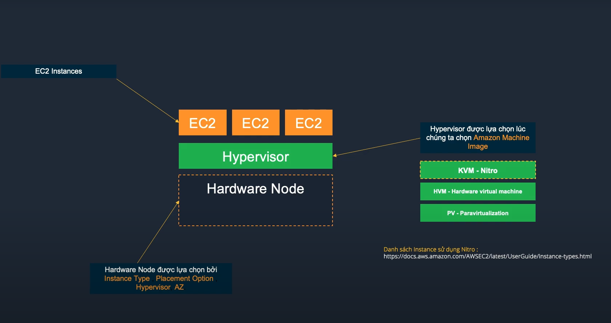

# Module 03 - Dịch vụ Compute VM trên AWS

## Module 03-01 - Amazon Elastic Compute Cloud ( EC2 )

### 1. Khái niệm
- **Amazon EC2** tương tự như máy chủ ảo hoặc máy chủ vật lý truyền thống.  
- Đặc điểm:  
  - **Khởi tạo nhanh**.  
  - **Co giãn tài nguyên linh hoạt** (scale up/down).  
  - Hỗ trợ nhiều **workload**:  
    - Web hosting  
    - Ứng dụng  
    - Database  
    - Authentication service  
    - Và bất kỳ công việc nào máy chủ thông thường có thể đáp ứng.  

---

### 2. Instance Type
- Cấu hình EC2 không tùy ý cấu hình mà lựa chọn qua **Instance Type**.  
- Instance Type quyết định:  
  - **CPU**: Intel / AMD / ARM (Graviton 1/2/3) / GPU  
  - **Memory**  
  - **Network**  
  - **Storage**

---

### 3. Kiến trúc EC2

#### Thành phần
- **EC2 Instances**: máy ảo chạy trên AWS.  
- **Hypervisor**: lớp ảo hóa quản lý nhiều EC2 chạy trên một **Hardware Node**.  
- **Hardware Node**: máy chủ vật lý chứa Hypervisor và EC2.  

#### Lựa chọn ảnh hưởng đến Hardware Node
- Khi chọn **Instance Type**, **Placement Option**, **Hypervisor**, **AZ** → sẽ quyết định Hardware Node nào được sử dụng.

#### Hypervisor
- Được xác định khi chọn **Amazon Machine Image (AMI)**.  
- Loại Hypervisor:  
  - **KVM - Nitro** (mới, hiệu năng cao).  
  - **HVM - Hardware Virtual Machine**.  
  - **PV - Paravirtualization** (cũ, ít dùng).  

👉 **Danh sách Instance dùng Nitro**:  
[EC2 Instance Types with Nitro](https://docs.aws.amazon.com/AWSEC2/latest/UserGuide/instance-types.html)

---

