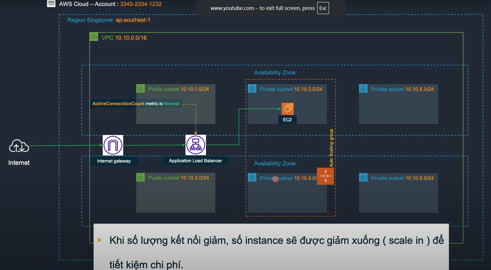

# Module 03 - Dịch vụ Compute VM trên AWS

## Module 03-01 - Amazon Elastic Compute Cloud (EC2)

### 1. Khái niệm
- **Amazon EC2**: máy chủ ảo trong AWS, tương tự như server vật lý truyền thống.  
- Đặc điểm:  
  - **Khởi tạo nhanh**.  
  - **Co giãn tài nguyên linh hoạt** (scale up/down).  
  - Hỗ trợ nhiều **workload**:  
    - Web hosting  
    - Ứng dụng  
    - Database  
    - Authentication service  
    - Bất kỳ tác vụ nào server thông thường đáp ứng được.  

---

### 2. Instance Type
- Không tự chọn cấu hình mà **chọn qua Instance Type**.  
- Instance Type quyết định:  
  - **CPU**: Intel / AMD / ARM (Graviton 1/2/3) / GPU  
  - **Memory**  
  - **Network**  
  - **Storage**

---

### 3. Kiến trúc EC2

#### Thành phần
- **EC2 Instances**: máy ảo chạy workload.  
- **Hypervisor**: lớp ảo hóa, quản lý nhiều EC2 trên 1 **Hardware Node**.  
- **Hardware Node**: server vật lý chứa Hypervisor + EC2.

#### Lựa chọn ảnh hưởng đến Hardware Node
- Phụ thuộc vào: **Instance Type, Placement Option, Hypervisor, AZ**.

#### Hypervisor
- Xác định khi chọn **Amazon Machine Image (AMI)**.  
- Loại Hypervisor:  
  - **KVM - Nitro** (mới, hiệu năng cao).  
  - **HVM - Hardware Virtual Machine**.  
  - **PV - Paravirtualization** (cũ, ít dùng).  

👉 **Danh sách Instance dùng Nitro**:  
[EC2 Instance Types with Nitro](https://docs.aws.amazon.com/AWSEC2/latest/UserGuide/instance-types.html)

---

### 4. Amazon Machine Image (AMI)
- Dùng để provision ra **1 hoặc nhiều EC2 Instance**.  
- Nguồn AMI:  
  - AMI do AWS cung cấp.  
  - AWS Marketplace.  
  - Custom AMI (tự tạo từ EC2).  
- AMI bao gồm:  
  - **Root OS volume**  
  - Quyền sử dụng (AI Account)  
  - Mapping **EBS volume** cho EC2  

---

### 5. Storage cho EC2

#### 5.1 Elastic Block Store (EBS)
- **Block storage** gắn trực tiếp vào EC2 (thông qua mạng riêng EBS).  
- Tồn tại độc lập, độ sẵn sàng **99.999%** (replicate giữa 3 Storage Node trong 1 AZ).  
- EC2 **không thể chạy nếu không có root EBS**.  
- **Optimized EC2 Instance**: tối ưu cho EBS throughput.  
- **EBS Multi-Attach**: Nitro cho phép 1 volume gắn nhiều EC2.  
- Backup bằng **Snapshot** sang S3:  
  - Snapshot đầu tiên → full.  
  - Sau đó → incremental.  

#### 5.2 Instance Store
- **NVMe local disk** tốc độ rất cao, nằm trên Hardware Node.  
- Đặc điểm:  
  - **Xóa dữ liệu** khi **stop EC2**.  
  - Không mất dữ liệu khi **restart** hoặc **crash**.  
  - Không có replication → không an toàn cho dữ liệu quan trọng.  
- Ứng dụng: workload cần **IOPS cực cao**.  
  - swap  
  - paging  
  - buffer/cache  
  - log  

👉 Thường kết hợp Instance Store + EBS để vừa nhanh, vừa an toàn.

#### So sánh EBS vs Instance Store
| Thuộc tính         | EBS (Elastic Block Store)          | Instance Store                |
|--------------------|------------------------------------|-------------------------------|
| Loại storage       | Network-attached (qua EBS network) | Local NVMe disk trên host     |
| Độ bền dữ liệu     | Rất cao (replicate 3 node)         | Mất khi stop instance         |
| Hiệu năng          | Tốt, tùy loại SSD/HDD              | Rất cao (hàng triệu IOPS)     |
| Backup             | Snapshot sang S3                   | Không hỗ trợ                  |
| Use case           | Database, ứng dụng quan trọng      | Cache, log, temporary storage |

---

### 6. Key Pair
- **Public key / Private key** dùng để mã hóa thông tin đăng nhập EC2.  
- Khi launch EC2, gắn với Key Pair để SSH/Remote Desktop.

---

### 7. User Data & Metadata
- **EC2 User Data**: script chạy lần đầu khi provision từ AMI.  
  - Linux: bash script.  
  - Windows: PowerShell.  
- **EC2 Metadata**: thông tin về EC2 Instance (private IP, public IP, hostname, SG, …).  
  - Có thể dùng để cấu hình hostname hoặc script động.

---

### 8. Auto Scaling
- **EC2 Auto Scaling**: tăng/giảm số lượng instance theo **scaling policy**.  
- Có thể tự động đăng ký EC2 vào **Elastic Load Balancer**.  
- Hỗ trợ nhiều **AZ** và nhiều **pricing option**.  

---

### 9. EC2 Auto Scaling với Load Balancer

#### Kiến trúc

- **Internet Gateway (IGW)**: cho phép traffic từ Internet đi vào VPC.  
- **Application Load Balancer (ALB)**: phân phối traffic đến các EC2 instance trong nhiều AZ.  
- **Auto Scaling Group (ASG)**: tự động tăng/giảm số lượng EC2 theo nhu cầu.  
- **Private Subnets**: chứa EC2 instance, chỉ được truy cập thông qua ALB.  

#### Cơ chế hoạt động
1. Người dùng gửi request từ Internet → qua **IGW** → **ALB**.  
2. ALB phân phối request đến EC2 instance trong **Private Subnet**.  
3. **ASG** giám sát metric (ví dụ: CPUUtilization, ActiveConnectionCount).  
   - Nếu tải tăng cao → **Scale Out** (thêm EC2 instance).  
   - Nếu tải giảm → **Scale In** (giảm EC2 instance) để tiết kiệm chi phí.  
4. EC2 trong ASG tự động đăng ký/deregister với ALB.  

#### Lợi ích
- **High Availability**: phân tán instance trên nhiều AZ.  
- **Fault Tolerance**: nếu 1 instance lỗi, ALB + ASG thay thế ngay.  
- **Cost Optimization**: chỉ chạy số instance cần thiết.  

---

#### Ví dụ thực tế
- Website bán hàng online:  
  - Ban ngày lượng truy cập cao → ASG tự động scale out thêm 5–10 EC2.  
  - Ban đêm truy cập ít → ASG scale in còn 2 EC2, tiết kiệm chi phí.  

---

## Module 03-02 - EC2 Auto Scaling - EFS/FSx - Lightsail - MGN

### 1. Pricing Options của EC2
EC2 có **4 tùy chọn giá** chính:

- **On-demand**  
  - Trả tiền theo giờ / phút / giây.  
  - Giá cao nhất.  
  - Phù hợp cho workload chạy < **6h/ngày**.  

- **Reserved Instance (RI)**  
  - Cam kết 1-3 năm để được **discount lớn**.  
  - Bị giới hạn theo **Instance Type/Family**.  

- **Saving Plans**  
  - Cam kết 1-3 năm để được **discount**.  
  - **Linh hoạt hơn RI**, không bị cố định Instance Type/Family.  

- **Spot Instance**  
  - Tận dụng tài nguyên dư thừa của AWS.  
  - Giá **rẻ nhất** (giảm đến 90%).  
  - Có thể bị **terminate trong 2 phút** khi AWS cần tài nguyên.  

👉 Có thể **kết hợp nhiều Pricing Options** trong **Auto Scaling Group** để tối ưu chi phí.  

---

### 2. Amazon Lightsail
- Dịch vụ compute giá rẻ (bắt đầu từ **3.5$/tháng**).  
- Mỗi instance đi kèm một lượng **data transfer miễn phí** (rẻ hơn EC2).  
- Phù hợp: workload nhẹ, test/dev, không cần CPU cao liên tục (> 2h/ngày).  
- Hỗ trợ **backup bằng snapshot**.  
- Chạy trong **VPC đặc biệt**, có thể **kết nối tới VPC thường qua VPC Peering**.  

---

### 3. Amazon EFS (Elastic File System)
- Dịch vụ **file storage dạng NFSv4**.  
- Cho phép nhiều EC2 mount cùng lúc (scale đến **petabyte**).  
- Chỉ hỗ trợ **Linux**.  
- **Tính phí theo dung lượng sử dụng** (khác EBS tính phí theo dung lượng cấp phát).  
- Có thể mount vào **On-premises** qua **Direct Connect** hoặc **VPN**.  

---

### 4. Amazon FSx
- Dịch vụ **file storage dạng SMB (Windows)**.  
- Hỗ trợ **Windows và Linux**.  
- Tính phí theo **dung lượng sử dụng**.  
- Tích hợp **deduplication** → tiết kiệm **30-50% chi phí**.  

---

### 5. AWS Application Migration Service (MGN)
- Dùng để **migrate** hoặc **replicate** workload lên AWS.  
- Hỗ trợ **Disaster Recovery Site**.  
- Cơ chế:  
  - Liên tục sao chép máy chủ nguồn (physical/VM) → EC2 trên AWS.  
  - Trong quá trình replicate → dùng **staging server** nhỏ gọn hơn.  
  - Khi cut-over → MGN tự tạo và launch **EC2 Instances** để thay thế.  

---

### 6. So sánh nhanh các dịch vụ
| Dịch vụ       | Loại Storage/Compute | Hệ điều hành hỗ trợ | Đặc điểm nổi bật | Use Case |
|---------------|----------------------|---------------------|------------------|----------|
| **EBS**       | Block Storage        | Linux/Windows       | Gắn vào 1 EC2, backup bằng snapshot | Database, ứng dụng |
| **EFS**       | File Storage (NFSv4) | Linux               | Mount nhiều EC2, scale petabyte | Shared file system |
| **FSx**       | File Storage (SMB)   | Windows/Linux       | Hỗ trợ SMB, deduplication | Windows apps, AD integration |
| **Lightsail** | Compute VM           | Linux/Windows       | Rẻ, có data transfer kèm | Test/dev, web nhỏ |
| **MGN**       | Migration            | Any                 | Replicate server lên AWS | DR site, migration |

---

