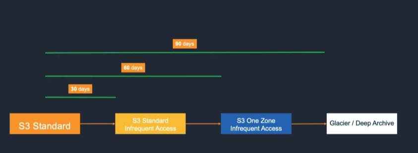
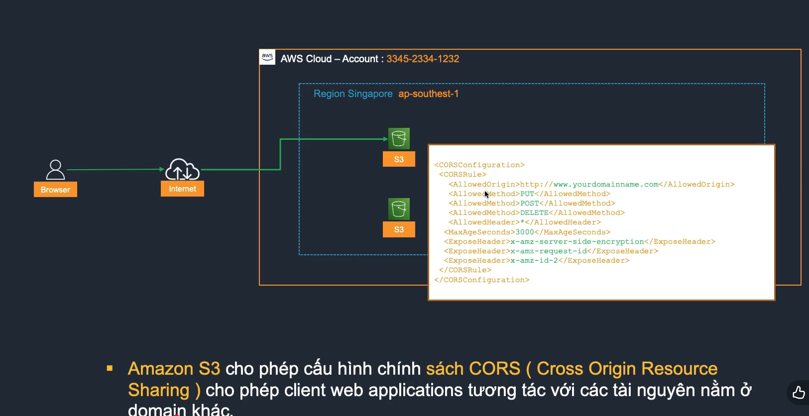
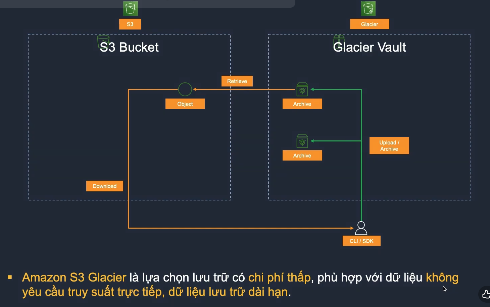
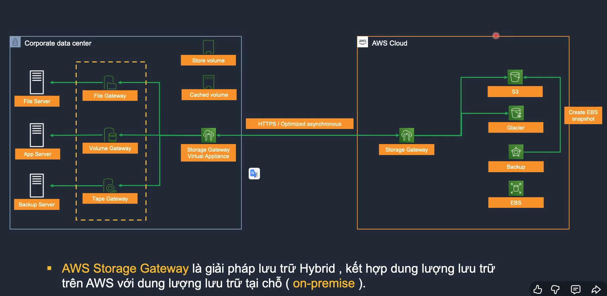

  # Module 04 - Dịch vụ lưu trữ trên AWS

## Module 04-01 - Amazon Simple Storage Service (S3)

### 1. Khái niệm
- **Amazon S3**: kho lưu trữ ở mức đối tượng, có nghĩa là nếu muốn thay đổi một phần của tập tin, bạn phải thực hiện thay đổi rồi tải lại toàn bộ tập tin đã sửa đổi.  
- S3 phù hợp với các loại dữ liệu ghi một lần đọc nhiều lần (WORM = Write Once Read Many).

---

### 2. Đặc điểm
- S3 không giới hạn tổng khối lượng dữ liệu lưu trữ.  
- Mỗi đối tượng không được lớn hơn **5TB**.  
- Theo mặc định, dữ liệu trong S3 được nhân bản trên **3AZ** trong 1 Region.  
- S3 có khả năng kích hoạt **event trigger** cho phép tự động thực hiện hành động khi một số sự kiện xảy ra (tải lên, xóa object...).  

---

### 3. Độ bền & tính năng
- S3 được thiết kế để đạt **durability 99.9999999%** và **availability 99.99%**.  
- Hỗ trợ **multipart upload** để tải các đối tượng lớn.  
- Cần tạo **S3 bucket** để lưu trữ object:  
  - `https://[bucket-name].s3.amazonaws.com`  
  - `https://[bucket-name].s3.amazonaws.com/capture.mp4`  

---

### 4. Amazon S3 - Access Point
- Cho phép tạo các **endpoint riêng biệt (unique hostname)** cho ứng dụng, người dùng, hoặc nhóm.  
- Có thể cấu hình phân quyền khác nhau cho mỗi Access Point.  

---

### 5. Amazon S3 - Storage Class
- Các lớp lưu trữ giúp tối ưu chi phí:  
  - **S3 Standard**: dữ liệu truy cập thường xuyên.  
  - **S3 Standard-IA**: dữ liệu ít truy cập.  
  - **S3 Intelligent-Tiering**: tự động di chuyển object theo mức độ truy cập.  
  - **S3 One Zone-IA**: dữ liệu ít truy cập, có thể tái tạo lại, chỉ lưu ở 1 AZ.  
  - **Glacier / Deep Archive**: dữ liệu lưu trữ dài hạn, ít truy cập.  

- Có thể thiết lập **Object Lifecycle Management** để luân chuyển dữ liệu giữa các lớp theo thời gian.  

  
> Object Lifecycle Management sẽ di chuyển object sau số ngày quy định, tính từ ngày object được tạo.  

---

### 6. Amazon S3 - Static Website & CORS
- Hỗ trợ **static website hosting** (HTML, media, SPA).  
- Hỗ trợ **CORS** (Cross-Origin Resource Sharing) để cho phép truy vấn tài nguyên từ domain khác.  

---

### 7. Amazon S3 - Control Access
- **Access Control List (ACL)**: kiểm soát truy cập ở mức bucket và object.  
- **Bucket Policy & IAM Policy**: kiểm soát tập trung, dễ quản lý hơn ACL.  

---

### 8. Amazon S3 - Endpoint & Versioning
- **S3 Endpoint**: cho phép truy cập S3 qua mạng private của AWS.  
- **Versioning**: hỗ trợ khôi phục object khi bị xóa/ghi đè.  
  - Xóa object → đánh dấu deleted.  
  - Ghi đè object → tạo phiên bản mới.  
  - Có thể khôi phục phiên bản cũ.  

---

### 9. Amazon S3 - Object Key & Performance
- Mỗi object được gán một **Object Key** (flat structure, không phân cấp).  
- S3 quản lý bằng **partitions**, được hash theo prefix của object key.  
- **Best practice**: dùng **random prefix** để phân tán object trên nhiều partition → cải thiện hiệu năng.  

---

### 10. Amazon S3 - Glacier
- **S3 Glacier**: lưu trữ chi phí thấp, cho dữ liệu dài hạn, ít truy cập.  
- Không thể truy xuất trực tiếp, cần **retrieve** về bucket S3.  
- 3 mức retrieve:  
  - **Expedited**: 1–5 phút.  
  - **Standard**: 3–5 giờ.  
  - **Bulk**: 5–12 giờ.  

---

## Module 04-04 - Snow Family - Storage Gateway - Backup

### 1. Snow Family - Snowball
- Hỗ trợ **migrate dữ liệu on-premise → AWS** ở quy mô PB.  
- Mỗi Snowball chứa tới **80TB**.  
- Thiết bị được ship về AWS Region để lưu vào **S3/Glacier**.  
- Cần cài **Snowball Client** để xác minh, nén, mã hóa và transfer dữ liệu.  

---

### 2. Snowmobile
- Hỗ trợ migrate dữ liệu ở quy mô **Exabyte**.  
- Mỗi Snowmobile chứa tới **100PB**.  
- Dữ liệu được ship về AWS Region và lưu trong **S3/Glacier**.  

---

### 3. AWS Storage Gateway
- Giải pháp **Hybrid Storage** kết hợp Cloud + On-premise.  
- Các loại Storage Gateway:  
  - **File Gateway**: lưu/truy xuất object trong S3 qua NFS/SMB.  
  - **Volume Gateway**: block storage dùng iSCSI, dữ liệu lưu trong S3 → có thể tạo EBS snapshot.  
  - **Tape Gateway**: giả lập Virtual Tape Library (VTL), lưu trữ băng từ ảo trong S3 hoặc Glacier.  

---

### 4. RTO / RPO
- **RTO (Recovery Time Objective)**: thời gian tối đa để khôi phục dịch vụ.  
  - Ví dụ: sự cố lúc 2PM, RTO = 4h → dịch vụ phải phục hồi trước 6PM.  
- **RPO (Recovery Point Objective)**: khoảng thời gian dữ liệu có thể bị mất.  
  - Ví dụ: backup mỗi ngày 1 lần → RPO = 24h.  

---

### 5. Disaster Recovery trên AWS
- Có nhiều chiến lược DR tùy theo SLA (RTO/RPO):  
  1. Backup & Restore.  
  2. Pilot Light (Active–Standby).  
  3. Warm Standby (Low-capacity Active–Active).  
  4. Full-scale Active–Active.  

---

### 6. AWS Backup
- Dịch vụ quản lý **backup schedule**, **retention policy**, và giám sát cho nhiều dịch vụ AWS:  
  - Amazon EBS  
  - Amazon EC2  
  - Amazon RDS  
  - DynamoDB  
  - Amazon EFS  
  - AWS Storage Gateway Volumes  
